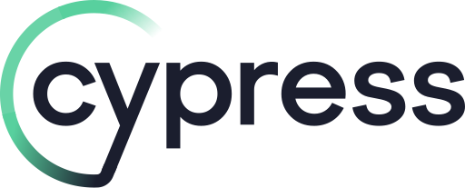

# Demo Blaze 🔥

<p align="center">
  <a href="https://cypress.io">
    
    </a>
</p>

<p align="center">
   <a href="https://cloud.cypress.io/projects/nv36p8/runs">
    
  </a>

A simple automation project built using Cypress for testing a web based application. Its main purpose is to demonstrate a translation from plain text test cases to cypress test automation scripts within the time range (2 hours). My goal here is to give a glimpsy of a fully functional cypress automation project can be.

## Table of Contents

- [Getting Started](#getting-started)
- [Installation](#installation)
- [Usage](#usage)
- [Tests](#tests)
- [Contributing](#contributing)
- [License](#license)

## Getting Started 🛠

Instructions on how to get the project up and running on a local machine. Include prerequisites and any initial setup required.

## Installation 🚀

Step-by-step instructions on how to install the project. Include any package managers or commands required.

```bash
npm install
```

## Usage 💻

Its mainly purpose is for CoderByte evaluation.

## Tests ⚡️

```bash
npm cypress run
```

## Contributing ✨

Thanks goes to all wonderful people reviewing ([emoji key](https://allcontributors.org/docs/en/emoji-key))

## License

[](https://github.com/cypress-io/cypress/blob/master/LICENSE)

This project is licensed under the terms of the [MIT license](/LICENSE).
